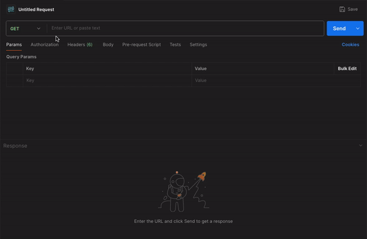

# SQLGenie

This application allows users to input natural language queries, which are then converted into SQL queries using OpenAI's GPT-4 model. The goal of this application is to simplify database querying for users who may not be familiar with SQL syntax. By leveraging the power of natural language processing (NLP) and machine learning, the application translates a user's request into a valid SQL query that can be executed on a database.

One will have to provide the Open API Key in environment variable `OPEN_API_KEY` to use the Application

* Python Version: `3.12`

* AI Model: [gpt-4o-mini](https://platform.openai.com/docs/models/gpt-4o-mini)

* Install Requirements: `pip install -r requirements.txt`

* Run Application: `gunicorn --workers=2 --bind=127.0.0.1:5000 app:app`

* Chat Home Page: `http://127.0.0.1:5000`

* Build Docker Image: `docker build --platform linux/amd64 -t mathmateai/sql-genie:latest -f Dockerfile .`

* Run Docker Image: `docker run -e OPEN_API_KEY='' -p 5000:5000 --name sql-genie -d mathmateai/sql-genie`

* Docker Compose: `docker compose --project-name sql-genie -f docker-compose.yml up --force-recreate --build -d`

## Demo

